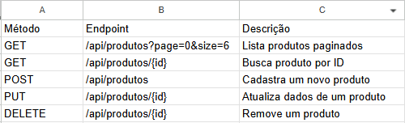

#  PLMarket — Full-Stack E-Commerce

[](https://reactjs.org/)
[](https://spring.io/projects/spring-boot)
[](https://tailwindcss.com/)
[](https://www.postgresql.org/)
[](https://plmarket.netlify.app)

PLMarket é uma aplicação e-commerce Full-Stack moderna para equipamentos e periféricos de alta performance. O projeto conta com uma interface reativa em **Dark/Neon Glassmorphism** construída em **React + Tailwind CSS** e um backend robusto em **Java com Spring Boot**, fornecendo uma API RESTful com suporte a paginação nativa e tratamento de concorrência.

---

## Demonstração & Links

- **Web App (Frontend):** [plmarket.netlify.app](https://plmarket.netlify.app)
- **API REST (Backend):** Hospedada em ambiente de nuvem (Render)

---

## Principais Funcionalidades

- **Catálogo Paginado:** Consumo de paginação do Spring Boot (`Pageable`) para otimização de tráfego e performance no cliente.
- **Destaques da Semana:** Carrossel horizontal responsivo ("Mais Cobiçados") para produtos em promoção/destaque.
- **Carrinho Dinâmico (Drawer):** Gerenciamento de estado global com persistência no `localStorage`.
- **Filtros e Ordenação:** Busca em tempo real por nome, filtro por categoria e ordenação por preços e relevância.
- **Gestão CRUD:** Modais interativas para criação, edição e exclusão de produtos com confirmação.
- **Resiliência e Fallback:** Tratamento visual para cold start de servidores em nuvem e fallback dinâmico para URLs de imagens corrompidas.

---

##  Arquitetura do Sistema

```text
[ React / Tailwind CSS ]  --->  HTTP / REST API  --->  [ Spring Boot API ]
   (Netlify Deploy)                                       (Render Deploy)
                                                                |
                                                                v
                                                        [ Database H2 / Postgre ]
```

## Tecnologias Utilizadas
### Frontend
- React 18 (Vite)
- Tailwind CSS (Estilização e Glassmorphism)
- Lucide React (Iconografia)
- Sonner (Notificações Toast)

### Backend
- Java 17 / Spring Boot 3
- Spring Data JPA (Persistência e Paginação)
- Spring Web (API RESTful)
- H2 Database / PostgreSQL

## Como Executar o Projeto Localmente
Pré-requisitos
Node.js (v18 ou superior)

Java JDK (17 ou superior)

Maven (opcional, pode usar o ./mvnw incluído)

# 1. Backend (Spring Boot)

## Clone o repositório
git clone [https://github.com/seu-usuario/plmarket.git](https://github.com/seu-usuario/plmarket.git)

## Acesse a pasta do backend
cd plmarket/backend

## Execute a aplicação
./mvnw spring-boot:run

A API estará acessível em http://localhost:8080.

# 2. Frontend (React)

## Em outro terminal, acesse a pasta do frontend
cd plmarket/frontend

## Instale as dependências
npm install

## Inicie o servidor de desenvolvimento
npm run dev

O frontend estará acessível em http://localhost:5173.

### Endpoints Principais da API



# Desenvolvido por Pedro Henrique Lobato.

LinkedIn: [linkedin.com/in/seu-perfil](https://linkedin.com/in/lobato-dev/)

Portfolio: https://lobato-phdev.netlify.app/